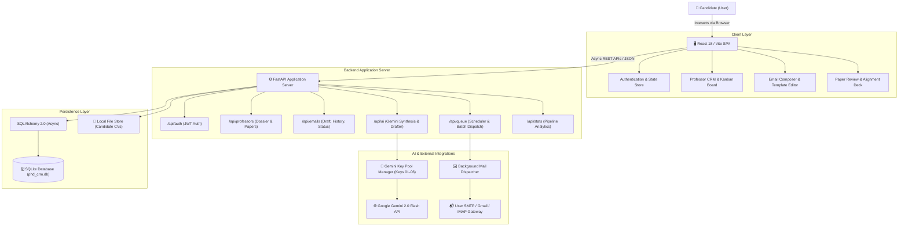

# System Architecture Document
## PhD Professor Review & Cold Outreach Intelligence CRM

---

### 1. ARCHITECTURE

#### 1.1 High-Level System Overview
The system is designed as a decoupled, modern multi-tier web application consisting of:
1. **Frontend Presentation Tier (SPA)**: A fast, responsive, high-density Single Page Application built with modern React and Tailwind CSS, featuring rich data grids, Kanban pipeline boards, an in-app email composer, paper review drawers, and real-time activity dashboards.
2. **Application & API Gateway Tier (FastAPI)**: A lightweight, asynchronous Python REST API server providing CRUD endpoints, authentication, queue management, and orchestrating interactions between the database, the AI engine, and the mail dispatcher.
3. **AI Intelligence Engine (Gemini Multi-Key Gateway)**: A dedicated service managing Google Gemini API interactions using the multi-key pool (`GEMINI_API_KEY_01` through `GEMINI_API_KEY_06`), providing intelligent round-robin balancing, automatic quota retry handling, paper abstract synthesis, and personalized outreach drafting.
4. **Outreach & Mail Dispatcher (Background Worker)**: An asynchronous background queue worker responsible for executing scheduled dispatches, enforcing human-like send intervals (45–120s delays), maintaining daily delivery velocity limits, and recording delivery status logs.
5. **Data Persistence Tier**: Relational SQLite database with SQLAlchemy 2.0 async ORM, migrations, and local storage for candidate documents (CV/Resume PDFs).

#### 1.2 Component Interaction Diagram



#### 1.3 Data Flow & Outreach Lifecycle
1. **Dossier Ingestion**: User enters or imports professor profile and target papers.
2. **AI Review & Synthesis**: User triggers AI Review. The backend calls the Gemini Pool, supplying the candidate's profile and the professor's paper abstract. Gemini generates key methodological takeaways, alignment score, and inquiry angles.
3. **Email Generation & Customization**: User requests an email draft. Gemini generates a tailored subject and body. The user edits and refines the draft in the interactive editor.
4. **Queueing & Scheduling**: The user schedules the email for immediate staggered sending or future dispatch.
5. **Execution & Logging**: The Background Mail Worker sends the email via the user's SMTP credentials, logs the sent timestamp, and moves the professor's CRM status to `Sent`.
6. **Interaction Tracking**: Follow-up dates are calculated, and responses or interview invites are tracked in the CRM pipeline.

---

### 2. FOLDER & FILE STRUCTURE

The project is structured with clean separation of concerns between backend services, frontend interface, and root configurations:

```
phd/
├── .env                                # Environment variables & API keys
├── PRD.md                              # Product Requirements Document
├── architecture.md                     # System Architecture & Design
├── rules.md                            # Development Rules & AI Boundaries
├── phases.doc.md                       # Phased Implementation Plan
├── design.md                           # UI/UX & Visual Design Tokens
├── memory.md                           # Project State & Session Memory
│
├── backend/                            # FastAPI Backend Server
│   ├── app/
│   │   ├── __init__.py
│   │   ├── main.py                     # App entry point & middleware
│   │   ├── config.py                   # Pydantic Settings & environment config
│   │   │
│   │   ├── core/                       # Core utilities & security
│   │   │   ├── security.py             # JWT generation, password hashing
│   │   │   └── database.py             # SQLAlchemy async engine & session
│   │   │
│   │   ├── models/                     # SQLAlchemy Database Models
│   │   │   ├── user.py                 # User & candidate profile models
│   │   │   ├── professor.py            # Professor & research paper models
│   │   │   ├── email.py                # Email drafts, templates, history
│   │   │   └── queue.py                # Scheduled & batch dispatch tasks
│   │   │
│   │   ├── schemas/                    # Pydantic v2 Request/Response Schemas
│   │   │   ├── user.py
│   │   │   ├── professor.py
│   │   │   ├── email.py
│   │   │   └── ai.py
│   │   │
│   │   ├── services/                   # Business Logic & External Integrations
│   │   │   ├── ai_service.py           # Gemini Multi-Key Pool & Prompt Engine
│   │   │   ├── mail_service.py         # SMTP dispatcher & verification
│   │   │   ├── queue_service.py        # Background task queue & rate limiter
│   │   │   └── analytics_service.py    # Pipeline stats and response metrics
│   │   │
│   │   └── api/                        # REST API Route Controllers
│   │       ├── api_router.py           # Main router aggregator
│   │       ├── auth_routes.py          # /api/auth
│   │       ├── professor_routes.py     # /api/professors
│   │       ├── email_routes.py         # /api/emails
│   │       ├── ai_routes.py            # /api/ai
│   │       └── stats_routes.py         # /api/stats
│   │
│   ├── requirements.txt                # Python backend dependencies
│   └── tests/                          # Backend unit & integration tests
│       ├── test_auth.py
│       ├── test_professors.py
│       ├── test_ai_service.py
│       └── test_mail_service.py
│
├── frontend/                           # React 18 + Vite Frontend Application
│   ├── index.html                      # HTML5 root with Google Fonts
│   ├── package.json                    # Node dependencies & scripts
│   ├── vite.config.js                  # Vite configuration & API proxy
│   ├── tailwind.config.js              # Custom theme colors, typography
│   ├── src/
│   │   ├── main.jsx                    # React entrypoint
│   │   ├── App.jsx                     # Route definitions & global layout
│   │   ├── index.css                   # Global styles & Tailwind utilities
│   │   │
│   │   ├── context/                    # React Context State Providers
│   │   │   ├── AuthContext.jsx         # User auth & profile session
│   │   │   └── ThemeContext.jsx        # Dark/Light theme mode state
│   │   │
│   │   ├── services/                   # API Client Layer (Axios/Fetch)
│   │   │   ├── api.js                  # Base Axios instance with JWT interceptor
│   │   │   ├── professorApi.js
│   │   │   ├── emailApi.js
│   │   │   └── aiApi.js
│   │   │
│   │   ├── components/                 # Reusable UI Components
│   │   │   ├── common/                 # Buttons, Modals, Badges, Loaders
│   │   │   ├── layout/                 # Sidebar, Header, PageContainer
│   │   │   ├── pipeline/               # Kanban Column, Drag/Drop Card
│   │   │   ├── professor/              # ProfessorCard, PaperReviewModal
│   │   │   └── composer/               # EmailEditor, VariableTags, AIHelper
│   │   │
│   │   └── pages/                      # Application Page Views
│   │       ├── LoginPage.jsx           # Sign in & Account creation
│   │       ├── DashboardPage.jsx       # Overview statistics & recent alerts
│   │       ├── PipelinePage.jsx        # CRM Kanban board & stage transitions
│   │       ├── ProfessorsPage.jsx      # High-density searchable data table
│   │       ├── ProfessorDetailPage.jsx # Full dossier, papers, and review notes
│   │       ├── EmailCenterPage.jsx     # Outbox, drafts, sent logs & queue
│   │       └── SettingsPage.jsx        # SMTP config, Gemini keys, CV upload
│   └── public/                         # Static assets and icons
```

---

### 3. TECH STACK

#### 3.1 Backend Technologies
| Layer | Technology | Version / Spec | Purpose |
|---|---|---|---|
| **Language** | Python | 3.11+ | Clean, readable, performant backend logic |
| **Framework** | FastAPI | >= 0.110.0 | High-performance asynchronous REST API framework |
| **Data Validation** | Pydantic v2 | >= 2.6.0 | Strict schema definition and request validation |
| **ORM / Database** | SQLAlchemy | >= 2.0.0 (Async) | Modern asynchronous object-relational mapping |
| **Database Engine** | SQLite (aiosqlite) | 3.x | Lightweight, zero-configuration local embedded database |
| **Authentication** | PyJWT / Passlib | >= 2.8.0 / bcrypt | Secure password hashing and stateless JWT bearer tokens |
| **AI SDK** | `google-genai` / SDK | Official Google SDK | Direct connection to Google Gemini 2.0 Flash models |
| **Email Transport** | `aiosmtplib` / `email` | Standard Python | Async SMTP dispatch with TLS/SSL encryption |
| **Task Scheduling** | `APScheduler` / Asyncio | >= 3.10.0 | Background queue worker for delayed and batch email dispatches |

#### 3.2 Frontend Technologies
| Layer | Technology | Version / Spec | Purpose |
|---|---|---|---|
| **Runtime & Tooling**| Node.js & Vite | Vite 5.x | Ultra-fast development server and optimized build bundling |
| **UI Framework** | React | 18.x | Declarative component-based user interface |
| **Styling** | Tailwind CSS | 3.4.x | Utility-first responsive design with custom academic palette |
| **Icons** | Lucide React | Latest | Clean, modern feather-style vector icons |
| **Routing** | React Router DOM | 6.x | Client-side routing with protected view gates |
| **HTTP Client** | Axios | 1.6+ | Interceptor-managed API calls with automated JWT attachment |
| **Notifications** | React Hot Toast | Latest | Sleek user feedback alerts and queue updates |

#### 3.3 Infrastructure & Hosting
- **Local Development**: Unified setup running FastAPI on `http://localhost:8000` and Vite on `http://localhost:5173`.
- **Environment Management**: Single consolidated `.env` configuration file.
- **Portability**: Self-contained SQLite database that requires zero cloud database provisioning or external services other than the Gemini API.
